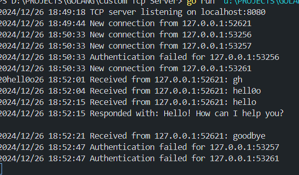

# Custom TCP Server


🚀 A custom TCP server built with Go.

## Table of Contents

- [Introduction](#introduction)
- [Features](#features)
- [Installation](#installation)
- [Usage](#usage)
- [Contributing](#contributing)
- [License](#license)

## Introduction

This project is a custom TCP server implemented in Go. It is designed to handle multiple client connections and provide a robust and efficient communication channel.

## Features

- 📡 Handles multiple client connections
- 🔒 Secure and efficient
- ⚡ High performance

## Installation

To install and run the server, follow these steps:

1. Clone the repository:
   ```sh
   git clone https://github.com/yourusername/custom-tcp-server.git
   ```
2. Navigate to the project directory:
   ```sh
   cd custom-tcp-server
   ```
3. Build the project:
   ```sh
   go build
   ```

## Usage

To start the server, run the following command:

```sh
./custom-tcp-server
```

You can connect to the server using any TCP client.


## Contributing

Contributions are welcome! Please fork the repository and submit a pull request.

## License

This project is licensed under the MIT License. See the [LICENSE](LICENSE) file for details.


