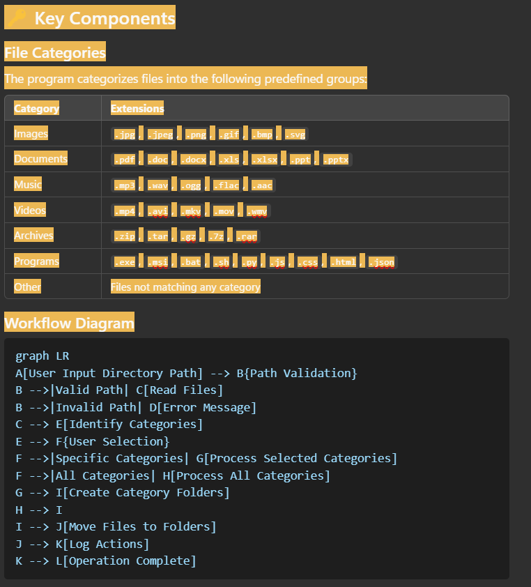

# 📂 File Organizer Project Documentation

## 🚀 Overview

The **File Organizer** is a command-line tool written in Go that efficiently organizes files in a specified directory based on their extensions. Files are grouped into predefined categories such as `Images`, `Documents`, `Music`, and more. This project ensures your directories remain clutter-free and well-structured.

### 🏆 Features:

- Organizes files by categories like `Images`, `Documents`, `Music`, `Videos`, etc.
- Allows user-defined category selection for organization.
- Supports recursive file organization.
- Logs operations to a file for transparency and debugging.
- Prevents accidental changes to sensitive system files.

## 🛠️ How It Works

1. **Input Path:** The program prompts the user to input the directory path to organize.
2. **Category Selection:** Users can choose specific categories or let the program organize all files.
3. **File Processing:** The program scans the directory (and subdirectories) and categorizes files based on their extensions.
4. **Folder Creation:** Creates new folders for each category if they do not exist.
5. **File Relocation:** Moves files into their respective category folders.
6. **Logging:** Logs all actions, errors, and warnings into `file_organizer.log`.

The program categorizes files into the following predefined groups:

### Workflow Diagram

### Program Flow

- **Validation:** Ensures the directory path exists.
- **Category Parsing:** Splits user input to decide which categories to organize.
- **File Relocation:** Uses Go’s `os` and `filepath` packages to move files.
- **Logging:** Captures details of each operation, including errors.

## 📄 Code Explanation

### Key Functions:

#### `getCategory(ext string) string`

Identifies the category for a file based on its extension.

- **Input:** File extension.
- **Output:** Corresponding category name.

#### `parseCategories(input string) []string`

Splits the user’s input into a list of categories.

- **Input:** Comma-separated string.
- **Output:** Slice of categories.

#### `contains(slice []string, item string) bool`

Checks if a slice contains a specific string.

- **Input:** Slice and string to check.
- **Output:** Boolean value.

## 📋 Usage Instructions

1. **Run the Program:**
   go run main.go

2. **Input Path:** Provide the path to the directory you want to organize.

3. **Confirm Root Drive:** If organizing a root drive, confirm the operation.

4. **Select Categories:** Specify categories or leave blank to organize all.

5. **View Results:** Check the organized files and `file_organizer.log` for operation details.

## 💡 Tips

- Avoid organizing sensitive directories like `C:\Windows`.
- Use meaningful folder names for better clarity.
- Regularly clean up unnecessary files.

## ⚠️ Warnings

- The program modifies the directory structure. Double-check the path before proceeding.
- Files with duplicate names may overwrite each other.
- Ensure sufficient disk space for file movement.

## 📝 Log File

The program generates a log file `file_organizer.log` in the working directory. It contains:

- Moved files.
- Errors encountered.
- Execution warnings.

## 🎯 Future Enhancements

- Add support for customizable categories.
- Include a dry-run mode to preview changes.
- Implement multi-threading for faster processing.
- Develop a GUI version for ease of use.

## 🛡️ License

This project is licensed under the [MIT License](LICENSE).

## ✨ Badges

