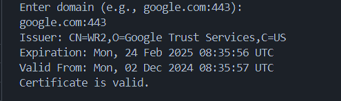

# TLS Certificate Checker


## Overview

TLS Certificate Checker is a Go-based tool to verify the validity of TLS certificates. It helps ensure that your certificates are up-to-date and properly configured.

## Features

- Check the expiration date of TLS certificates
- Validate the certificate chain
- Support for multiple domains
- Detailed reporting

## Installation

```bash
go get github.com/yourusername/tls-certificate-checker
```

## Usage

```bash
tls-certificate-checker -domain example.com
```

### Command Line Options

- `-domain`: Specify the domain to check
- `-port`: Specify the port (default is 443)
- `-timeout`: Set the timeout for the check (default is 10 seconds)

## Example

```bash
tls-certificate-checker -domain example.com -port 443 -timeout 5
```

### OUTPUT



## Contributing

Contributions are welcome! Please open an issue or submit a pull request.

## License

This project is licensed under the MIT License. See the [LICENSE](LICENSE) file for details.

## Contact

For any questions or suggestions, please contact [yourname@example.com](mailto:yourname@example.com).
